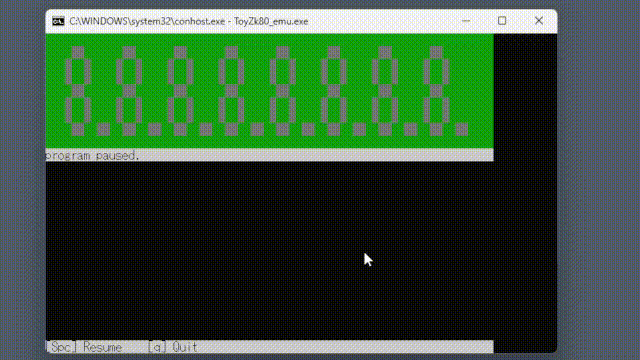

Zk80のアセンブラとかだよ。授業で使うので、オーバースペック気味に作ったつもり。

## アセンブラ
Z80のアセンブラ/逆アセンブラ。同じ行の`;`以降はコメントになる。
```
ToyZk80_asm [入力ファイル] -o [出力ファイル]
```
出力が指定されていないときは標準出力に出る。

入力に標準入力は使えないので、`/dev/stdin`などは入れないでください。（出力には使えます）

### アセンブル
入力ファイルのアセンブリを16進数で出力ファイルに出力する。

<details>
<summary>例</summary>

`in.asm`がこうなっているときに
```
LD A, 0
LD B, 10
loop:
ADD A,B
DEC B
LD C, A
LD A, 0
CP B
JR NZ, loop
LD A, C
HALT
```
このコマンドを実行することで
```sh
ToyZk80_asm ./in.asm -o ./out.hex
```

`out.hex`にこう出力される
```
3e00060a80054f3e00b820f87976
```

</details>

### 逆アセンブル
入力ファイルの内容を16進数で読み取り、アセンブリを出力ファイルに出力する。`--disassemble`フラグが必要。
<details>
<summary>例</summary>

`in.hex`がこうなっているとき
```
3e00060a80054f3e00b820f87976
```

このコマンドを実行することで
```sh
ToyZk80_asm ./in.hex -o ./out.asm --disassemble
```
こう出力される。
```asm
    LD A,00H
    LD B,0aH
LABEL_0: 
    ADD A,B
    DEC B
    LD C,A
    LD A,00H
    CP B
    JR NZ,LABEL_0
    LD A,C
    HALT 
```
</details>

### オプション
長くなってきたので[別のファイル](doc/assembler.md)に移動しました。

## エミュレータ

16進数が書かれている`out.hex`ファイルの内容を解釈して実行する。
```sh
./ToyZk80_emu
```

アセンブラの出力に指定してもいい
```sh
./ToyZk80_asm ./input.asm -o ./out.hex
./ToyZk80_emu
```
## 文句とか
- 改善案があるなら、NYSLなので、勝手にクローンして勝手に実装してください。
- 文句があるなら、Issueに書いたらたまに見るかもしれませんが、保証はしません
